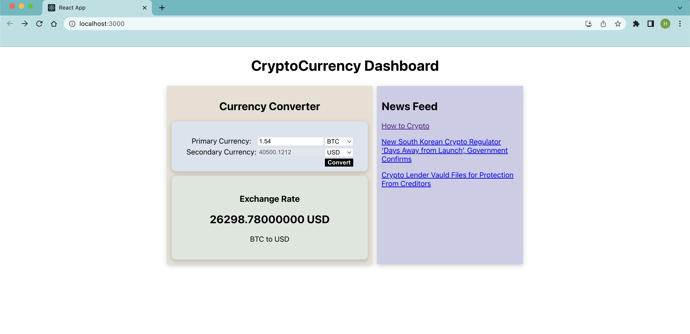

# CryptoCurrency-Dashboard

The Crypto Currency Dashboard is a web application built with React that allows users to convert desired currencies and view real-time conversion results. The application also provides exchange rate information for the selected currency. Additionally, it features a live news display, showcasing the top three news articles from three different sources, along with their respective links. The news content automatically refreshes to display the latest top three articles on each render.

The project utilizes two APIs from the RapidAPI library. 
- The Alpha Vantage API (URL: https://rapidapi.com/alphavantage/api/alpha-vantage) is used for obtaining exchange rates
- The Crypto News Live API (URL: https://rapidapi.com/dbh133/api/crypto-news-live9) is used for retrieving live cryptocurrency news.

To ensure secure API communication, an API key has been securely handled, and a backend has been implemented.

## Installation

1. Clone the repository to your local machine.
2. Navigate to the project directory.
3. Run the following command to install the necessary dependencies:

### `npm install`

This will install the required dependencies including axios, express, dotenv, and cors.

## Usage

To start the client-side or front-end of the application, run the following command:

### `npm run server`

Please note that you need to have Node.js installed on your machine to run the commands mentioned above.

## Additional Files

The repository includes two additional files:

- `physical_currency_list.csv`: This file contains a list of forex currency codes. 
- `digital_currency_list.csv`: This file contains a list of cryptocurrency codes.

You can refer to this file to add your desired currency and cryptocurrency codes to the `currencyConverter.js` file in the project.

Feel free to explore and modify these files as per your requirements.

